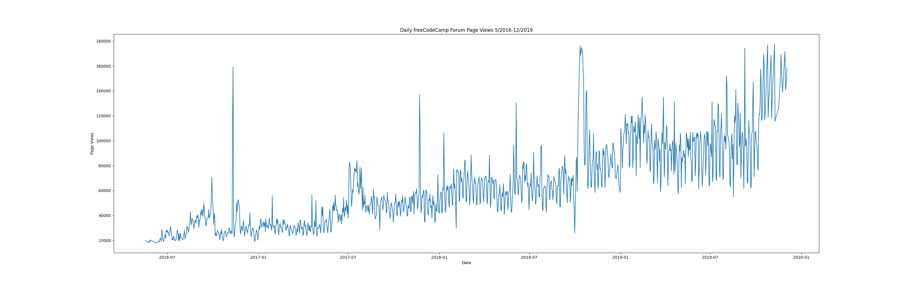
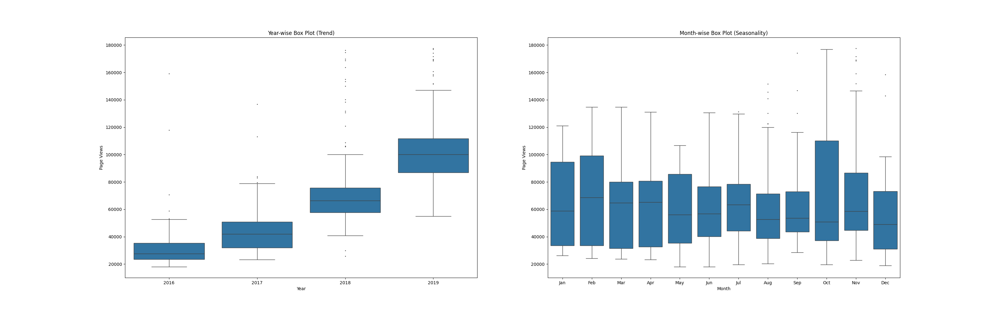

# Page View Time Series Visualizer
Visualize time series data using a line chart, bar chart, and box plots with Pandas, Matplotlib, and Seaborn.
 The project is from ["Data Analysis with Python" course from FCC](https://www.freecodecamp.org/learn/data-analysis-with-python/).

# Data
Dataset contains number of page views each day on the freeCodeCamp.org forum from 2016-05-09 to 2019-12-03. The data visualizations will help you understand the patterns in visits and identify yearly and monthly growth.

# What the app does
* Clear data,
* Draw line chart "Date / Page Views",
* Draw bar plot "Years / Average Page Views",
* Draw box plots with views distribution by years / months.

# Results
Forum activity grows over time.

### Line Plot "Years / Page Views"

### Bar Plot "Years / Average Page Views"

 Plot "Years / Average Page Views"](./img/bar_plot.png)

### Box plot of views by years and months

